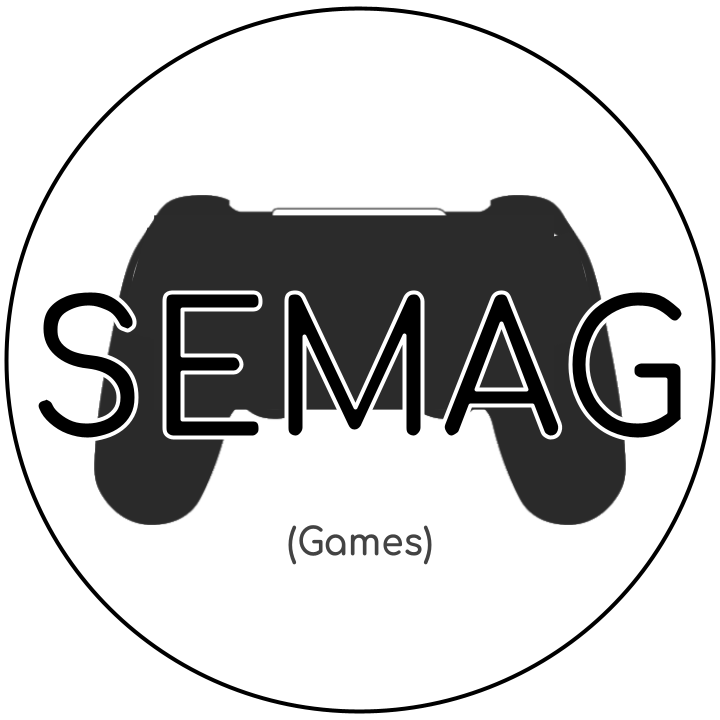
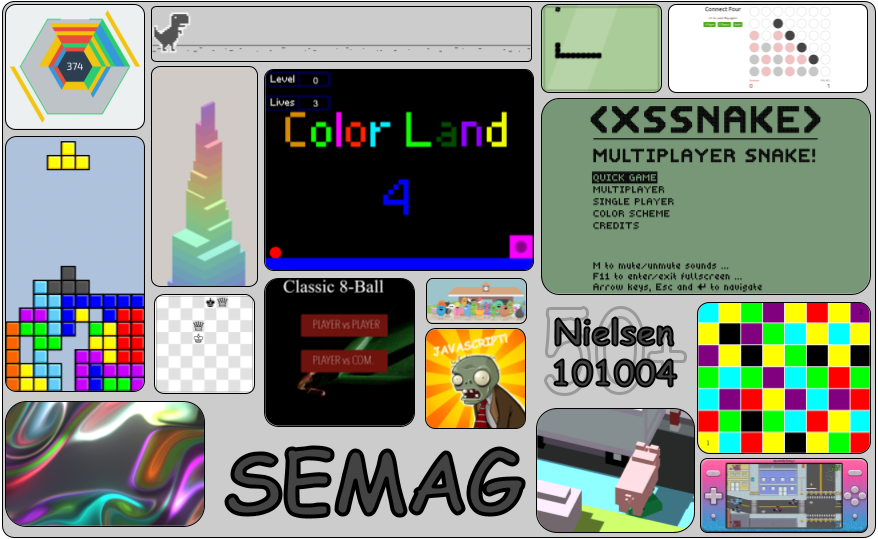
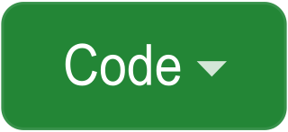

<!--
*** Thanks for checking out the Best-README-Template. If you have a suggestion
*** that would make this better, please fork the repo and create a pull request
*** or simply open an issue with the tag "enhancement".
*** Thanks again! Now go create something AMAZING! :D
-->

<!-- PROJECT SHIELDS -->
<!--
*** I'm using markdown "reference style" links for readability.
*** Reference links are enclosed in brackets [ ] instead of parentheses ( ).
*** See the bottom of this document for the declaration of the reference variables
*** for contributors-url, forks-url, etc. This is an optional, concise syntax you may use.
*** https://www.markdownguide.org/basic-syntax/#reference-style-links
-->
[![Contributors][contributors-shield]][contributors-url]
[![Forks][forks-shield]][forks-url]
[![Stargazers][stars-shield]][stars-url]
[![Issues][issues-shield]][issues-url]
[![MIT License][license-shield]][license-url]
[![LinkedIn][linkedin-shield]][linkedin-url]

<!-- PROJECT LOGO -->
 

  

  <h3 align="center">SEMAG</h3>

  

    50+ G.A.M.E.S Just for you!!!
     
    <a href="https://github.com/othneildrew/Best-README-Template"><strong>Explore the docs »</strong></a>
     
     
    <a href="https://github.com/nielsenlu2/SEMAG">View Demo</a>
    ·
    <a href="https://github.com/nielsenlu2/SEMAG/issues">Report Bug</a>
  

<!-- TABLE OF CONTENTS -->

  
Table of Contents

  <ol>
    <li>
      <a href="#about-the-project">About The Project</a>
      <ul>
        <li><a href="#built-with">Built With</a></li>
      </ul>
    </li>
    <li>
      <a href="#getting-started">Getting Started</a>
      <ul>
        <li><a href="#important">Important</a></li>
        <li><a href="#installation">Installation</a></li>
      </ul>
    </li>
    <li><a href="#usage">Usage</a></li>
    <li><a href="#roadmap">Roadmap</a></li>
    <li><a href="#contributing">Contributing</a></li>
    <li><a href="#license">License</a></li>
    <li><a href="#contact">Contact</a></li>
    <li><a href="#acknowledgments">Acknowledgments</a></li>
  </ol>

<!-- ABOUT THE PROJECT -->
## About The Project

There arent many websites on github that have more than one game on a website. So we decided to make one that has all of the G.A.M.E.S in one repo!

The G.A.M.E.S on SEMAG is not just only made by one person, It was made by many! 

A list of commonly used resources that I find helpful are listed in the acknowledgements. PS: This Readme File was a template of the [Best README Template](https://github.com/othneildrew/Best-README-Template) Initially made by the one and only [@Othneil Drew](https://github.com/othneildrew)

### Built With

* [Bootstrap](https://getbootstrap.com)
* [JQuery](https://jquery.com)
* [Laravel](https://laravel.com)
* [Replit](https://Replit.com)

<!-- GETTING STARTED -->
## Getting Started

1. Fork the project
2. Deploy the project
3. head to <b>Github-Username</b>.github.io/SEMAG

<!-- COMMENTS -->
### Important

***Some games will not work if you do not have the packages installed.***
### Downloading

1. Click the  to download.
2. Then unzip the file and click the `SEMAG Master` file

<!-- USAGE EXAMPLES -->
## Usage

You can use this website to play G.A.M.E.S!
For example: If you are bored at school, you can easily hop on SEMAG and play some G.A.M.E.S!

SEMAG has a huge selection of games! You can pick from Tetris to Minecraft!

<!-- ROADMAP -->
## Roadmap

See the [open issues](https://github.com/othneildrew/Best-README-Template/issues) for a list of proposed features (and known issues).

<!-- CONTRIBUTING -->
## Contributing

Contributions are what make the open source community such an amazing place to learn, inspire, and create. Any contributions you make are **greatly appreciated**.

1. Fork the Project
2. Create your Feature Branch (`git checkout -b feature/AmazingFeature`)
3. Commit your Changes (`git commit -m 'Add some AmazingFeatures'`)
4. Push to the Branch (`git push origin feature/AmazingFeature`)
5. Open a Pull Request

<!-- LICENSE -->
## License

Distributed under the MIT License. See `LICENSE` for more information.

<!-- CONTACT -->
## Contact

Luke Nielsen:
* Github: [@nielsenlu2](https://github.com/nielsenlu2)
* Email: [@nielsenlu2](mailto:nielsenlu2@wsdstudent.net)
* Email: [@nielsen101004](mailto:nielsen101004@gmail.com)

Project Repo: [https://github.com/nielsenlu2/SEMAG](https://github.com/nielsenlu2/SEMAG)  
Project Website: [https://nielsenlu2.github.io/SEMAG/](https://nielsenlu2.github.io/SEMAG/)

<!-- ACKNOWLEDGEMENTS -->
## Acknowledgements
* [GitHub Emoji Cheat Sheet](https://www.webpagefx.com/tools/emoji-cheat-sheet)
* [Img Shields](https://shields.io)
* [Choose an Open Source License](https://choosealicense.com)
* [GitHub Pages](https://pages.github.com)
* [Animate.css](https://daneden.github.io/animate.css)
* [Loaders.css](https://connoratherton.com/loaders)
* [Slick Carousel](https://kenwheeler.github.io/slick)
* [Smooth Scroll](https://github.com/cferdinandi/smooth-scroll)
* [Sticky Kit](http://leafo.net/sticky-kit)
* [JVectorMap](http://jvectormap.com)
* [Font Awesome](https://fontawesome.com)

<!-- MARKDOWN LINKS & IMAGES -->
<!-- https://www.markdownguide.org/basic-syntax/#reference-style-links -->
[contributors-shield]: https://img.shields.io/github/contributors/nielsenlu2/SEMAG.svg?style=for-the-badge
[contributors-url]: https://github.com/nielsenlu2/SEMAG/graphs/contributors
[forks-shield]: https://img.shields.io/github/forks/nielsenlu2/SEMAG.svg?style=for-the-badge
[forks-url]: https://github.com/nielsenlu2/SEMAG/network/members
[stars-shield]: https://img.shields.io/github/stars/nielsenlu2/SEMAG.svg?style=for-the-badge
[stars-url]: https://github.com/nielsenlu2/SEMAG/stargazers
[issues-shield]: https://img.shields.io/github/issues/nielsenlu2/SEMAG.svg?style=for-the-badge
[issues-url]: https://github.com/nielsenlu2/SEMAG/issues
[license-shield]: https://img.shields.io/github/license/nielsenlu2/SEMAG.svg?style=for-the-badge
[license-url]: https://github.com/nielsenlu2/SEMAG/blob/master/LICENSE.txt
[linkedin-shield]: https://img.shields.io/badge/-LinkedIn-black.svg?style=for-the-badge&logo=linkedin&colorB=555
[linkedin-url]: https://linkedin.com/in/othneildrew
[product-screenshot]: images/screenshot.png
